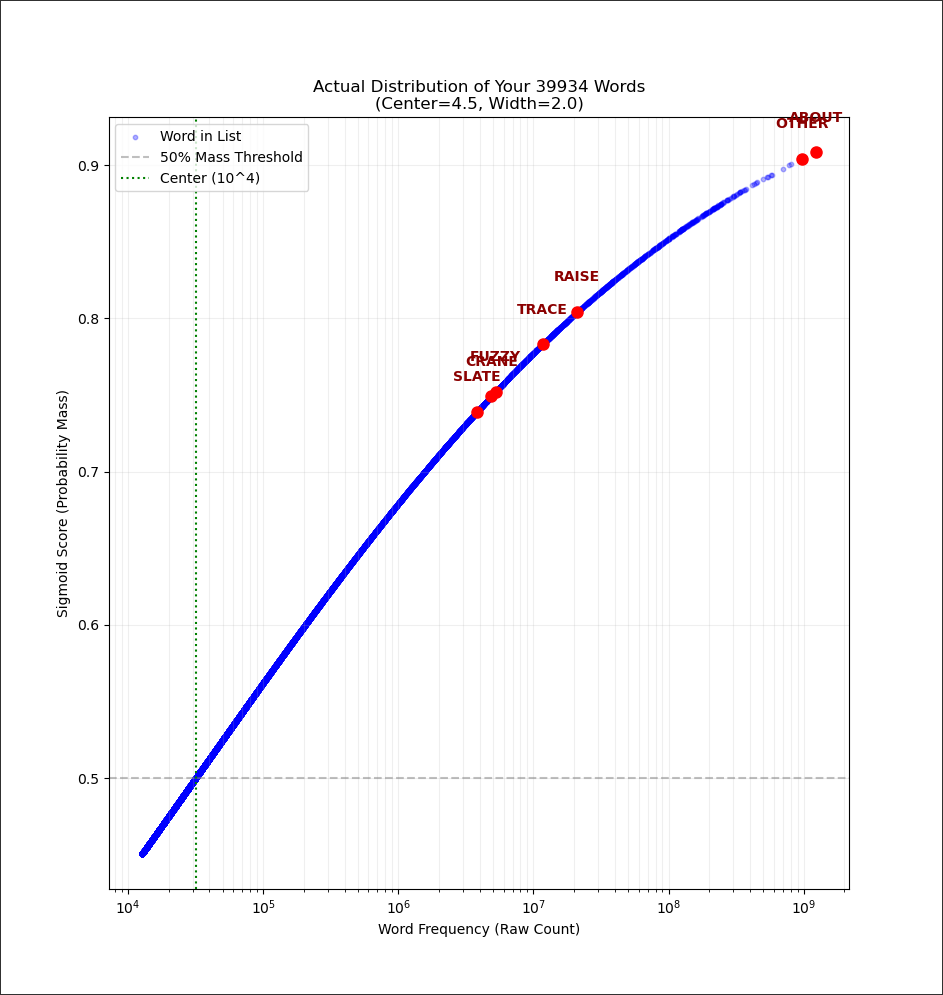
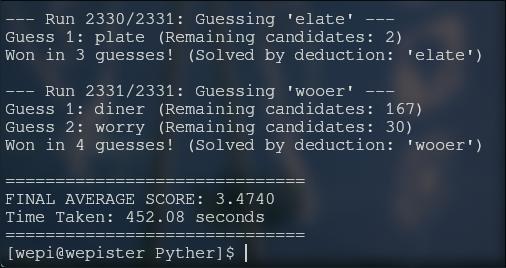
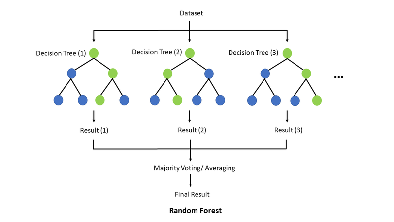
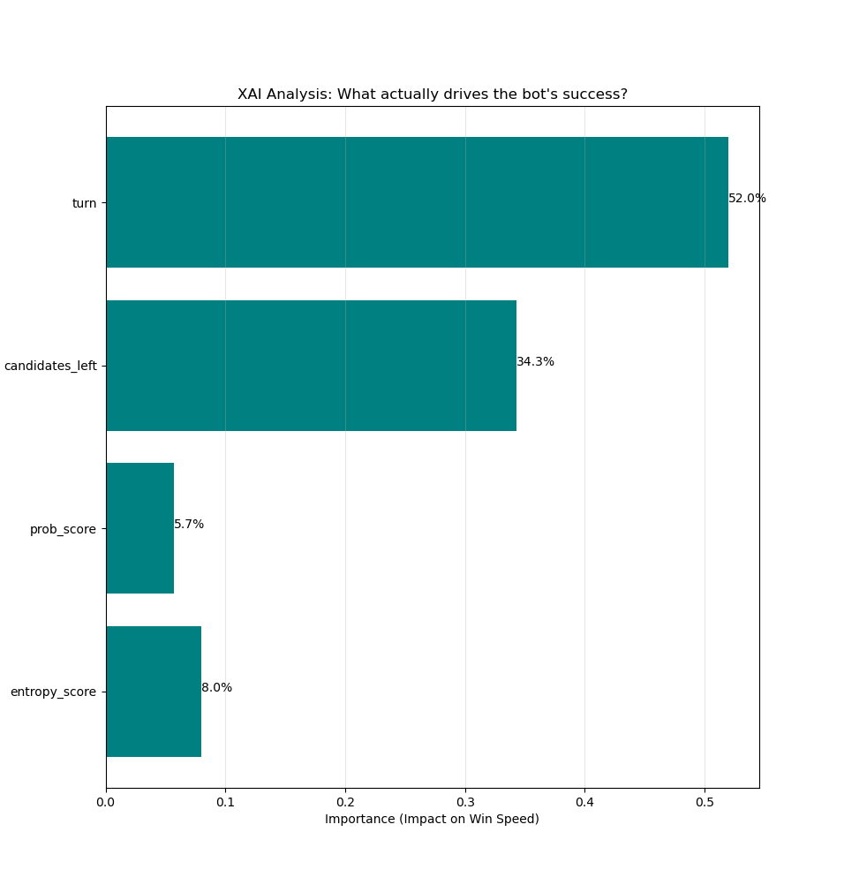
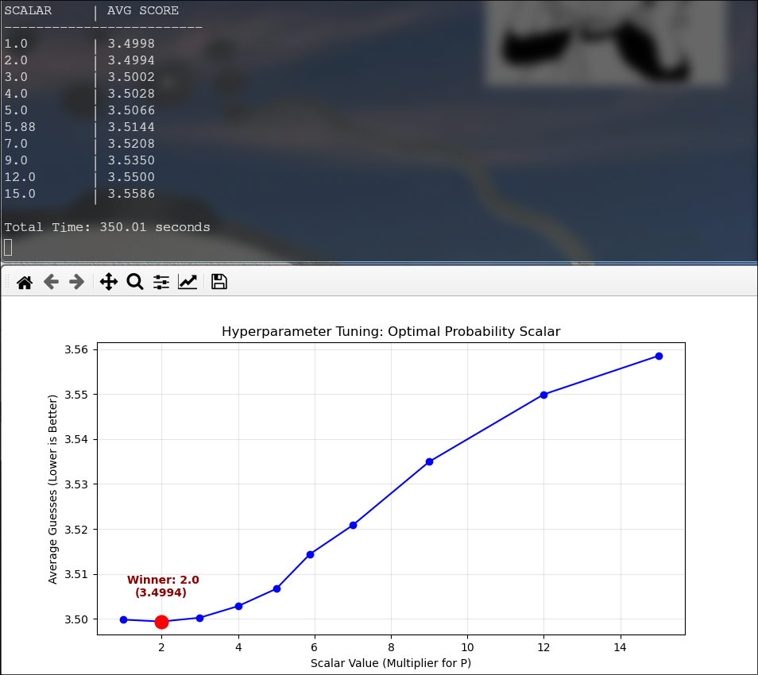
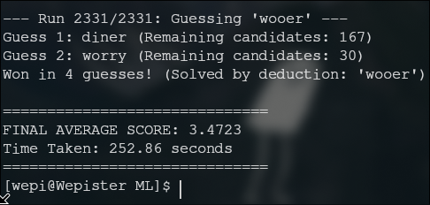
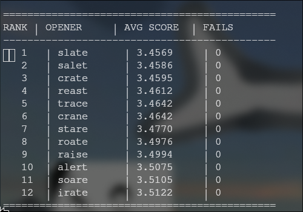
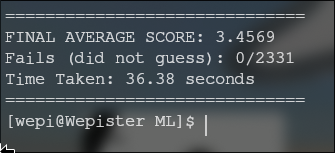

# Wordlebot
This repository contains the development of a bot that plays wordle as a personal project.
## Acknowledgements

The core algorithm and information theory approach for this Wordle solver were heavily inspired by 3Blue1Brown's video, "[Solving Wordle using information theory](https://www.youtube.com/watch?v=v68zYyaEmEA)".(Highly recommend watching it, really fun video)

The accompanying repository can be found [here]([https://github.com/3b1b/videos/tree/master/2022/wordle](https://github.com/3b1b/videos/tree/master/_2022/wordle)).
# Roadmap

- 1). get list of words
- 2). determine the possible bits of information you can get from it based on each possible case
- 3). get the flatest distribution possible, meaning that every case is almost equiprobable
- 4). update after current guess
## steps
### Get list
The list was obtained from [here](https://wordraiders.com/wordle-words/) using the [words_scraper.py](/code/words_scraper.py) script and saved in [here](/code/word_list.txt)
### Determine information per word 
Each letter can be grey, green or yellow. Having 5 letters this gives us 243 possible combinations, **BUT** it is important to consider that due to the nature of the game there are five pattterns that can't happen.

- YGGGG
- GYGGG
- GGYGG
- GGGYG
- GGGGY

This is because having a green letter means that the letter is located at the correct slot, therefore no other letter can take its place. Taking this into consideration a yellow letter can't exist if there isn't yellow or grey present, because it needs a place to go.

Finally, the number of possible cases is given by:

$3^5-5=238$


For each word in the word list we have to check each case and determine how much information gives. Then, rank the avg information obtained per word so we can pinpoint the best guess at the moment.

First a "pattern" is defined to identify each possible case, where $0=grey$,$1=yellow$ and $2=green$. Then, this can be used to define an entropy function, in which all possible patterns for a certain guess will be grouped to determine how likely is each pattern to occur. Now, having the probability of each pattern for a certain guess, Shannon's entropy can be calculated as:

$\[E[x]=\sum_{i=1}^{n} p_i\cdot -log_2(p_i)\]$ where $p = (times a pattern appears) / (possible answers)$

Once the entropy for each guess is calculated, it is possible to rank each guess. This process can be iterated until the answer is reached.

There's a special case in this approach, when there are only 2 options left a lot of words will be classified as the highest entropy since there are only two options, meaning that the word only has to provide 1 bit of information to be the best guess. Although this approach works, it "wastes" one guess on going from 2 words to one. To solve this, a new criteria is applied, the bot picks one of the answers and goes for it on a 50/50. This effectively reduced the number of guesses from 4 to 3 in some cases, avg guesses per word went down from $~3.67$ to $~3.56$ with this.

This can be checked running the script [logic.py](/code/logic.py). (there are two methods which will be tested further in this README).


### Simulation
For this section, two ways of implementing entropy to the best guess were applied, one were the bot always chose the highest entropy option and one where the bot chose one of the top 4.

Both methods were run through the 2331 possible answers in which the bot always got to the answer, giving the following results.


It is notable to mention that given the circumstances, the top 4 strategy could perform better than the top 1 strategy, for example, the next picture only simulated 50 random cases.


This is only mentioned anecdotically since neither of the strategies showed clear dominance in lower number of games. 


Additionally, a rank of the best opening words was made using the [ranking.py](/code/ranking.py) script, this ranking can be found in the file [ranked_word_list.txt](/code/ranked_word_list.txt).

Here's the first 20:

| Rank | Word | Entropy (Bits) |
| :--- | :--- | :--- |
| 1. | `raise` | 5.8772 |
| 2. | `slate` | 5.8585 |
| 3. | `irate` | 5.8305 |
| 4. | `crate` | 5.8304 |
| 5. | `trace` | 5.8272 |
| 6. | `arise` | 5.8172 |
| 7. | `stare` | 5.8088 |
| 8. | `snare` | 5.7731 |
| 9. | `arose` | 5.7648 |
| 10. | `least` | 5.7539 |
| 11. | `stale` | 5.7429 |
| 12. | `alert` | 5.7421 |
| 13. | `crane` | 5.7381 |
| 14. | `saner` | 5.7364 |
| 15. | `alter` | 5.7127 |
| 16. | `later` | 5.7081 |
| 17. | `react` | 5.6916 |
| 18. | `leant` | 5.6859 |
| 19. | `trade` | 5.6797 |
| 20. | `learn` | 5.6556 |

---
# How to use
## Clone repository
Clone the repository and cd into the code folder

```
git clone https://github.com/aguscsc/Wordlebot
cd code/Pyther
```
Here you'll find scripts containing the main logic of this problem and a simulation to test it.

### logic.py
logic.py is made so you can interact with it, choosing your own opening word.
```
python logic.py
```
You'll be prompted to choose an opening and then provide the pattern formed with each guess

```
python logic.py 
enter your first word (you should start with the word raise, it gives ~5.87bits of information): raise
pattern please (grey=0, yellow=1, green=2): 01000
['about', 'local', 'black', 'today', 'total', 'human', 'adult', 'along', 'among', 'album', 'apply', 'woman', 'allow', 'thank', 'plant', 'alpha', 'coach', 'blank', 'plaza', 'adopt', 'vocal', 'float', 'focal', 'alloy', 'awful', 'tonga', 'adapt', 'loyal', 'aloud', 'clamp', 'cocoa', 'quota', 'champ', 'comma', 'gland', 'chalk', 'topaz', 'vodka', 'modal', 'bland', 'agony', 'annoy', 'cloak', 'nomad', 'chant', 'plank', 'polka', 'bylaw', 'llama', 'dogma', 'abbot', 'mocha', 'koala', 'flank', 'atoll', 'whack', 'tonal', 'junta', 'knack', 'aptly', 'tubal', 'octal', 'zonal', 'aloft', 'quack', 'flaky', 'flack', 'allot', 'afoot', 'amply', 'bloat', 'chaff', 'aloof', 'aback', 'clank', 'guava', 'clack', 'twang', 'aunty', 'foamy', 'allay', 'offal', 'guano', 'clang', 'afoul', 'loath', 'annul', 'loamy', 'gloat', 'aglow', 'gonad', 'pupal', 'uvula', 'qualm']
this answer gave you 4.632144437451229 bits of information, 94 words remain

the best guess is clout, giving 4.999748661056134 bits of information on avg
pattern please (grey=0, yellow=1, green=2): 00200
['among', 'agony']
this answer gave you 10.186733289128867 bits of information, 2 words remain

50/50 the word is among
pattern please (grey=0, yellow=1, green=2): 22222
['among']
this answer gave you 11.186733289128867 bits of information, 1 words remain

the correct word is ['among']
```

You can also change the strategy used changing the function used for best_guess

```
best_guess = entropy(answers, guess)
best_guess = find_top4(answers, guess)
```
### simulation.py (Not recommended, use Rust instead)
by running this script you'll be prompted to choose how many cases would you like to simulate. If you choose any number below 2331, cases will be random. If you choose "all", all 2331 cases will be tested on the two strategies. (**Be careful running this as it is not well optimized**)
```
python simulation.py 
How many runs? (Type 'ALL' for all 2331 answers): 
```
If you want to run the simulation for only one strategy, you just need to comment one of the following lines.

```
score_top1 = run_simulation(runs, master_answers, guess_list, logic.entropy)
score_top4 = run_simulation(runs, master_answers, guess_list, logic.find_top4)
```
### simulation.rs
As Python resulted to be very slow, simulation.rs and logic.rs were writen as an alternative, the results were the following

|script | Python | Rust |
| :--- | :--- | :--- |
| simulation | 4:10 min | 3.95 s |
| logic | 2.4748 s| 0.0607 s |


**Running simulation.rs**:
```
cd code/rustler
cargo run --bin simulation
```
You'll then be prompted for the number of runs you want to do, if it is less the entire list of possible answers they'll be random.

# Probability enhanced Shannon's entropy analysis

### The Limitation of Pure Entropy ("The Scientist")
Standard information-theoretic solvers maximize **Shannon Entropy**:
$$H(x) = -\sum p(x) \log_2 p(x)$$

This treats the search space as a **Uniform Distribution**. The solver prioritizes words that split the dictionary efficiently, even if those words are linguistically obscure. This results in efficient narrowing but fails to capitalize on highly probable answers in the mid-game.

Following the approach of the video mentioned previously, the entropy analysis can be enhanced taking the "likelyness" of each word and inputing as a new factor to rank how good each word is as a guess.

---

## ⚙️ Methodology

### The Utility Function (Score Addition)
To implement this, a linear combination of entropy and probability is used.**Addition** is used rather than Multiplication because the objectives are distinct: a word is valuable if it provides information **OR** if it is the answer.

$$Score(w) = E[\text{Information}] + P(w \text{ is Answer})$$

### Sigmoid Frequency Weighting
Raw word frequency follows a Zipfian distribution, which is ill-suited for linear scoring. We map raw counts to a normalized probability score $[0, 1]$ using a tuned **Sigmoid Function**:

$$P(w) = \frac{1}{1 + e^{-\frac{\log_{10}(\text{count}) - C}{W}}}$$

**Hyperparameter Calibration:**
* **Center ($C=4.5$):** Tuned to the "Internet Scale." Words with $10^{4.5}$ occurrences (~30k) represent the crossover point between "Obscure" and "Common."
* **Width ($W=2.0$):** A "Gentle Curve" selected to prevent the "Arrogance Trap." It ensures rare valid answers (e.g., `WOOER`) retain a non-zero probability mass ($\approx 0.35$), preventing the bot from ignoring them in random simulations.

The list containing the probability of each word can be accesed [here](/code/Pyther/lists/most_used_words_EN.txt)



### Candidate Re-Ranking
The utility function re-ranks candidates to favor "Human-Optimal" guesses without sacrificing mathematical rigor. Note how `LEAST` jumps in rank due to its high probability mass.

| Rank | Word | Final Score | Entropy ($E$) | Prob Mass ($P$) | Insight |
|:---|:---|:---|:---|:---|:---|
| 1 | **raise** | **6.6813** | 5.8772 | 0.8041 | Best Splitter |
| 2 | **trace** | 6.6103 | 5.8272 | 0.7831 | Balanced |
| 3 | **least** | 6.6087 | 5.7539 | **0.8548** | **Probability Boost** |
| 4 | **slate** | 6.5975 | 5.8585 | 0.7390 | Strong Opener |
| 5 | **arise** | 6.5876 | 5.8172 | 0.7704 | Good Splitter |
| 6 | **alert** | 6.5605 | 5.7421 | 0.8184 | Balanced |
| 7 | **later** | 6.5555 | 5.7081 | **0.8474** | High Frequency |
| 8 | **crate** | 6.5483 | 5.8304 | 0.7179 | Good Splitter |

## Results

After adding these changes, the average of tries per word obtained by running the simulation were the following:

|Pure Shannon | Enhanced Shannon |
| :--- | :--- |
| 3.5607 (tries per word) | 3.4740 (tries per word) |



This means that the added probability criteria improved the bot in approximately:

$$\frac{3.5607 - 3.4740}{3.5607} \approx 2.43\\%$$

---

# Machine Learning approach

To try to improve the current performance, it is possible to define weights for the entropy and probability mass components. To do this, the random forest algorithm was implemented, feeding it a simulation of all possible games. 

### Random Forest

Random forest is a meta-estimator that fits a number of classifying decision trees on various sub-samples of the dataset and uses averaging to improve predictive accuracy and control over-fitting. In this project, it was deployed not as the primary agent, but as an analytical tool to reverse-engineer the correlation between the bot's decision variables and win-speed.



After running the dataset through, it is possible to graph the "weight" of each factor, this analysis was made showing from turn 2 and forward due to the "hardcoded" nature of the first turn. The results were the following:



### Finding weights

Once a relation between the factors is found, it is possible to define the ranges of operation to apply weights. The data generated, was put through random forest for each interval recording the relation between entropy and probability mass.

|STAGE                     | ENTROPY IMP     | PROB IMP        | REC. WEIGHTS (E:P)
|:---|:---|:---|:---
|EARLY GAME (>100 words)   | 0.4298          | 0.5702        | 0.43 : 0.57
|MID GAME (10-100 words)   | 0.6460          | 0.3540        | 0.65 : 0.35
|END GAME (<10 words)      | 0.6798          | 0.3202        | 0.68 : 0.3202

$$Score(w) = W_E \cdot E[\text{Information}] + W_P \cdot P(w \text{ is Answer})$$

### Scalar Normalization

Before applying these weights, it was necessary to address a **Unit Mismatch**. Entropy values range from $0$ to $6$ bits, while Probability Mass ranges from $0$ to $1$. To make these terms comparable, we performed a parameter sweep to find an optimal **Normalization Scalar** for the probability component.



### First result

After defining this, the improvements were marginal, going from $3.474$ to $3.4723$ tries per word.



### Best opener

Revising the new entropy + probability mass list, results changed from previous lists. Taking this in consideration, 12 openers were run through a simulation using the new weights and scalar to determine the best opener overall.




Now using this new data, results were improved.



## Conclussion 

Having this new best opener word, the second approach (enhanced shannon) was modified to use the new best opener, obtaining the same results as the random forest approach. Therefore the weights approach, while valid, does not offer any crucial improvements over the existing enhanced shannon approach.

That being said, this section further validates the first and second approach.

## Reinforced Learning

**TODO**
